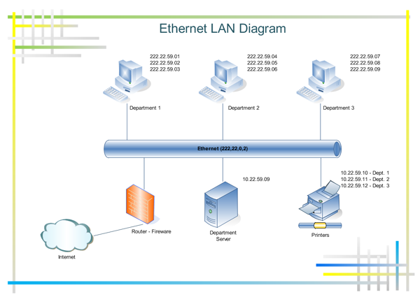
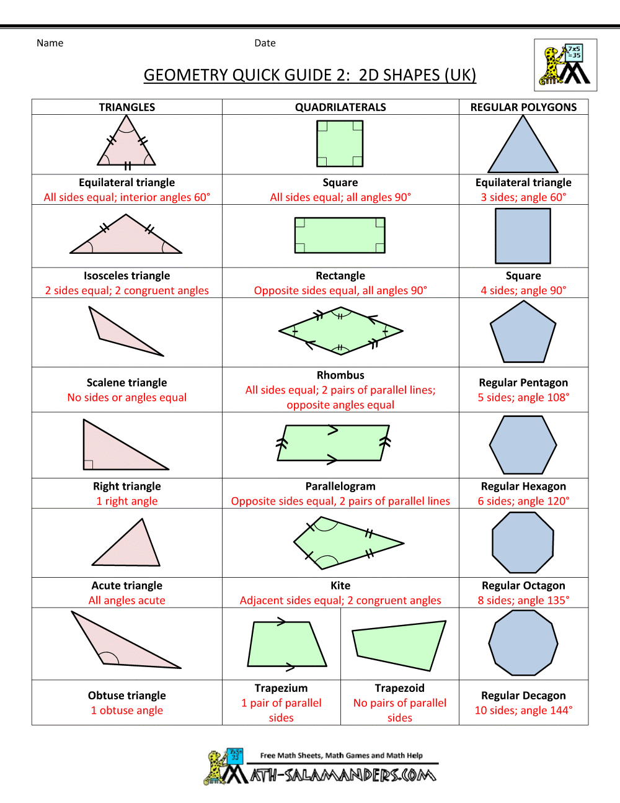

# english


|col1|col2|
|:---|:---|
|* hand the end part of a person's arm beyond the wrist, including the palm, fingers, and thumb |* handshake 英['hæn(d)ʃeɪk] 美['hænd'ʃek] n. 握手 |
|* privilege [ˈprɪvəlɪdʒ] a special right, advantage, or immunity granted or available only to a particular person or group of people."education is a right, not a privilege" |* prometheus 英  [prəu'mi:θju:s; -θiəs] n. 普罗米修斯 |
| * utensil 英  [juː'tens(ə)l] n. 用具，器皿  an implement, container, or other article, especially for household use. | * Ethernet n. [计] 以太网 ['i:θə,net] -- a system for connecting a number of computer systems to form a local area network, with protocols to control the passing of information -- In Unix, eth0 denotes the first ethernet card in your computer this is the network interface |
|portfolio 英  [pɔːt'fəʊlɪəʊ] n. 文件夹；证券投资组合 [case] a large, thin case used for carrying drawings, documents, etc. [FINANCIAL] a collection of company shares and other investments that are owned by a particular person  |* geometry  英[dʒɪ'ɒmɪtrɪ] n. 几何学 - the shape and relative arrangement of the parts of something.  |
| * monetization   [,mʌnitai'zeiʃən]  n. [金融] 货币化 monetize: convert into or express in the form of currency   | * propagate 英['prɒpəgeɪt] 美['prɑpə'get] vt.传播；传送；繁殖；宣传 If people propagate an idea or piece of information, they spread it and try to make people believe it or support it.   |
|||
|||
|||
